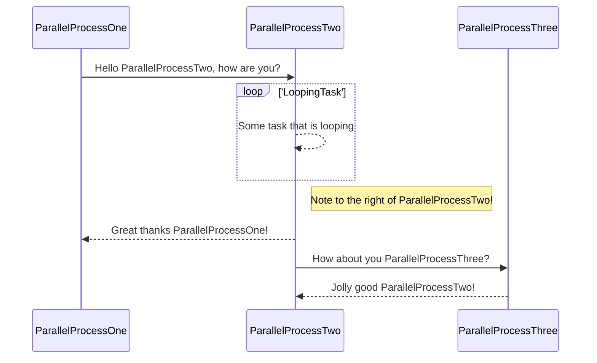

# Monorepo

<!-- TOC -->
* [Monorepo](#monorepo)
  * [Purpose](#purpose)
    * [JVM Purpose](#jvm-purpose)
  * [Current work in progress](#current-work-in-progress-)
  * [Unrelated tools](#unrelated-tools)
    * [ReadME diagram tool (mermaid for intellij)](#readme-diagram-tool-mermaid-for-intellij)
  * [Random unrelated scripts](#random-unrelated-scripts)
    * [Walking file tree](#walking-file-tree)
    * [Rename package structure](#rename-package-structure)
    * [Convert youtube video between two timestamps to mp3](#convert-youtube-video-between-two-timestamps-to-mp3)
  * [Influence repositories I found along the way](#influence-repositories-i-found-along-the-way)
<!-- TOC -->

## Purpose

- A showcase of the work I do in my spare time for any future employers

- A place which can house multi-language setups. The right tool for the job, rather than attempting
to use a sledgehammer when a screwdriver would have been better

- Each language or 'toolset' will then be have a structure
which allows high throughput, but maximum accountability for the terrible code I wrote

- This means I'm forced to learn from mistakes over long periods of time, as there's nothing
more valuable than working amongst code you wrote, and having to deal with the trade-offs or short
term decisions you may or may not have kept putting off

### JVM Purpose

1. Feel as though there's just so much wasted time with config and build systems in JVM land
2. Astonishing that out of the box there is no easy to way have high performance tests setup
3. All of the performance options are normally OFF by default, and because the build systems feel
   the need to support legacy systems, performance is on the back burner
4. This takes the approach that testing speeds are way too slow the majority of the time for what
   they could be, and aims to investigate pragmatic ways of solving something people are 'just used to'
5. The current end goal feels like a full test product, which allows you to:
    1. Detect regressions (in terms of both speed for individual tasks and overall time). Meaning that you may
       never have realised you introduced regressions, or a regression alongside an improvement that balanced each other out
    2. It focuses on how we might reduce what is universally considered 'slow' tests (integration/e2e tests)
    3. Parallelism and concurrently are on by default
    4. New java version comes out? Cool we upgrading due to speed improvements
6. Make writing code fun again, by not having to have wait for so much compilation!


## Current work in progress 

See [JVM README](toolset/jvm/README.md)

## Unrelated tools

### ReadME diagram tool (mermaid for intellij)



## Random unrelated scripts

### Walking file tree

```
   @OptIn(ExperimentalPathApi::class)
   rootDir.toPath().visitFileTree {
          onPreVisitDirectory { directory, _ ->
              if (directory.name == "build") {
                  directory.toFile().deleteRecursively()
                  FileVisitResult.SKIP_SUBTREE
              } else {
                  FileVisitResult.CONTINUE
              }
          }
     
          onVisitFile { file, _ ->
              if (file.extension == "class") {
                  file.deleteExisting()
              }
              FileVisitResult.CONTINUE
          }
      }
```


### Rename package structure

```
package com.nophasenokill.utils

import org.junit.jupiter.api.Test
import java.io.File
import java.io.IOException
import java.nio.file.*
import java.nio.file.attribute.BasicFileAttributes
import kotlin.io.path.pathString

class FileUtilsTest {

    @Test
    fun `should rename directories based on group and platform`() {

        // Example usage
        val startingDir = "/home/tomga/projects/gradle-project-setup-howto"
        val from = "org/example"
        val to = "com/nophasenokill"

        renameDirectoriesRecursively(startingDir, from, to)
    }

    fun renameDirectoriesRecursively(startingDir: String, from: String, to: String) {
        val startingPath = Paths.get(startingDir)
        val fromPath = Paths.get(from)
        val toPath = Paths.get(to)

        Files.walkFileTree(startingPath, object : SimpleFileVisitor<Path>() {
            @Throws(IOException::class)
            override fun preVisitDirectory(dir: Path, attrs: BasicFileAttributes): FileVisitResult {
                if (dir.endsWith(fromPath)) {
                    val newDir = startingPath.resolve(dir.toString().replace(fromPath.toString(), toPath.toString()))
                    if(!File(newDir.pathString).exists()) {
                        File(newDir.pathString).mkdirs()
                    }
                    Files.move(dir, newDir, StandardCopyOption.REPLACE_EXISTING)

                    // Remove empty parent directories
                    var parent = dir.parent
                    while (parent != null && !parent.equals(startingPath)) {
                        if (parent.toFile().list().isEmpty()) {
                            Files.delete(parent)
                        }
                        parent = parent.parent
                    }

                    return FileVisitResult.SKIP_SUBTREE
                }
                return FileVisitResult.CONTINUE
            }
        })
    }
}
```

### Convert youtube video between two timestamps to mp3

Example: This downloads the song 'glitter' from a tiny desk clip of Tyler the Creator

1. Go to: https://github.com/yt-dlp/yt-dlp/releases/latest
2. Download linux version: https://github.com/yt-dlp/yt-dlp/releases/download/2023.12.30/yt-dlp_linux
3. Assuming downloaded file is in ~/Downloads, run the following. Note: 'N1w-hDiJ4dM' for the output file name can be replaced with anything if you want
   ```
   ./yt-dlp_linux "https://www.youtube.com/watch?v=N1w-hDiJ4dM" -o N1w-hDiJ4dM.webm
   ```
4. Run below to convert to mp3:
   1. '797' is the start time in seconds
   2. '340' is the duration you want to clip it for in seconds
   3. 'glitter.mp3' is the output
   ```
   ffmpeg -ss 797 -t 340 -i N1w-hDiJ4dM.webm -vn -ab 128k glitter.mp3
   ```
5. Create and copy song to desktop directory named 'spotify-songs'
   ```
   mkdir spotify-songs && cp glitter.mp3 ~/Desktop/spotify-songs
   ```
6. Run below to add song tag metadata (in this case the title and artist):
   ```
   id3v2 -t "Glitter" -a "Tyler the Creator" ~/Desktop/spotify-songs/glitter.mp3
   ```

## Influence repositories I found along the way
* https://github.com/blundell/monorepo
* https://github.com/CXwudi/modern-gradle-template